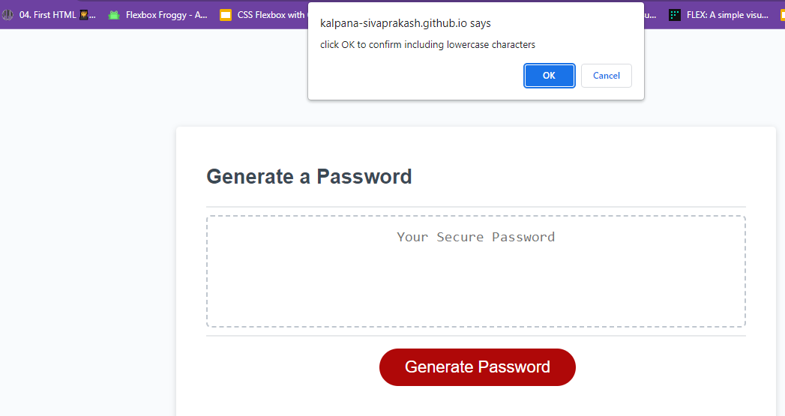
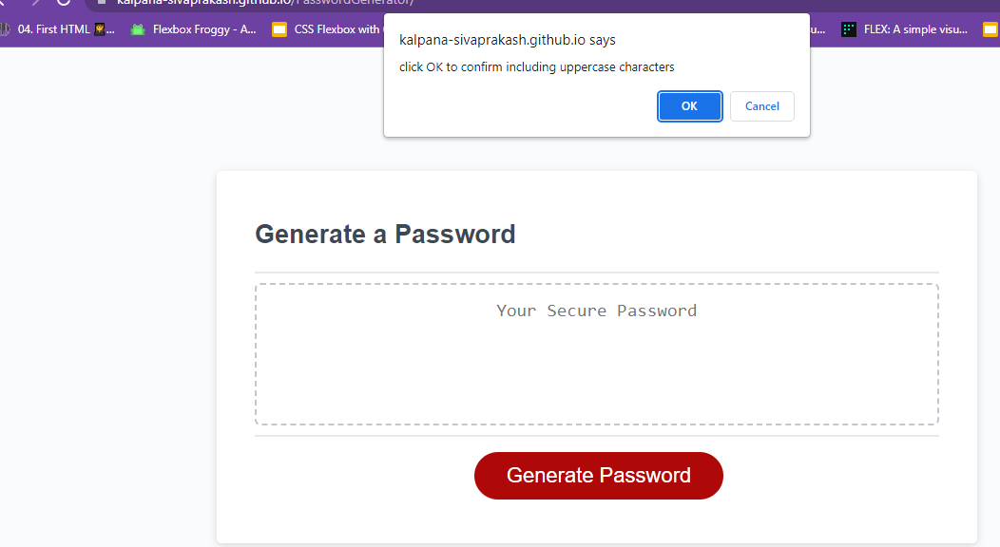
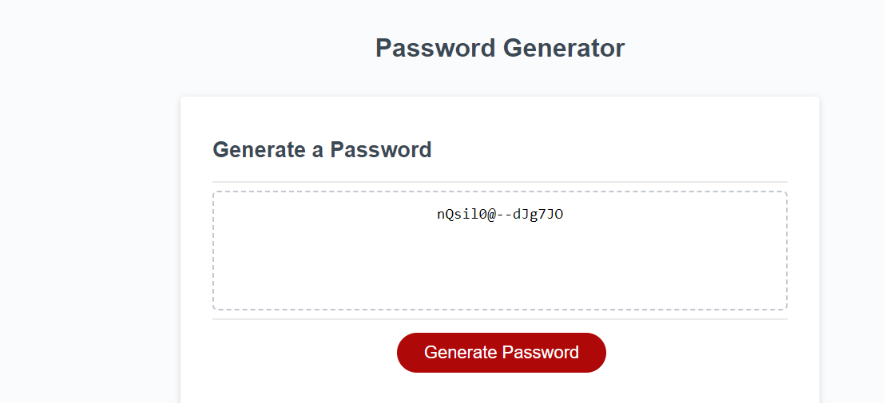

# PasswordGenerator
  
## Description
Generated random password when the button is clicked and finished setting up different password criterias. The Password criterias are Length of password: At least 10 characters but no more than 64, Character types: Lowercase, Uppercase, Numeric, Special characters. Based on the answers of all prompts, random password is being generated and displayed.

# Deployed Link:
https://kalpana-sivaprakash.github.io/PasswordGenerator/

# Repository Link:
https://github.com/Kalpana-Sivaprakash/PasswordGenerator

## Installation
N/A

## Usage 
This application is used to generate the random password when the user clicks the button with the series of prompts for password.

## Credits
N/A

## License
MIT license

## Features
N/A

## Contributing
N/A
